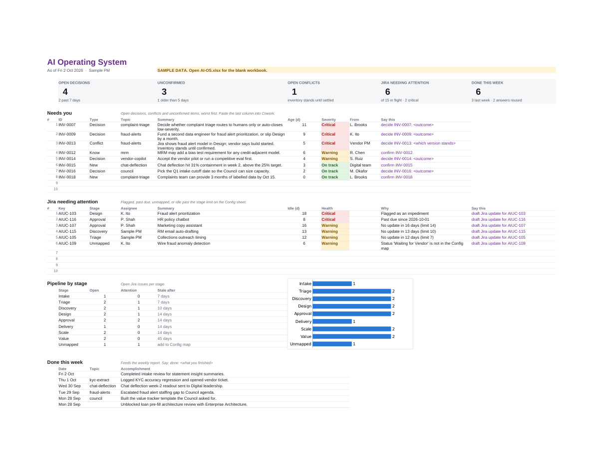

# AI Operating System: Copilot Cowork kit

The [AI First](https://rudiselbrett-lab.github.io/director-ai-strategy/#aifirst)
page, built as something you can use. It targets **Microsoft 365 Copilot
Cowork** and has two parts:

1. **A Cowork skill** (`ai-os`) with the operating rules and one protocol
   per reserved command.
2. **A workbook** (`AI-OS.xlsx`) that is both the system of record and the
   dashboard. Cowork appends rows; the Dashboard sheet recomputes from them
   with plain Excel formulas. Cowork never runs a script.

Nothing here touches the site. The site's files are unchanged.



## What maps to what

| AI First layer | What it became here |
|---|---|
| **Information**: boot sequence, privacy boundary, conventions | `SKILL.md` (read at the start of every Cowork session), the folder layout, the Private/ boundary, the regulated-data rules |
| **Action**: Inventory Protocol | Inventory sheet (append-only, typed rows, Confirmed/Resolved/Conflict by reference) + `inventory.md` |
| **Action**: Review Gate | `review-gate.md` (eight checks, MECE first, never rewrites) + Reviews sheet |
| **Action**: Support Guide | `support-guide.md` (log first, answer only if it traces, else route) + Answers sheet |
| **Action**: Human in the loop | Draft-don't-send, create-don't-overwrite, before/after, Jira read-only: in `SKILL.md`, applied to every command |
| **Automation**: Reserved commands | The command table in `SKILL.md`, and the Commands sheet as your reference card |
| **Automation**: Accomplishments flywheel | Done sheet + `weekly-report.md` |
| **Automation**: Integrity under change | `upkeep.md` + Changes sheet |
| The rest of the site (eight stages, staleness by stage) | Config sheet stage table and status map; the Jira sheet's Health column |

## What's in the folder

```
ai-os/
├── README.md                  this file
├── build_workbook.py          regenerates the workbooks (only needed if you change the structure)
├── ai-os-onedrive.zip         everything under OneDrive/, zipped
└── OneDrive/Documents/        mirrors your OneDrive: copy it across as-is
    ├── Cowork/skills/ai-os/   the skill: SKILL.md + 9 protocol files
    └── AI-OS/
        ├── AI-OS.xlsx         blank workbook for real use
        ├── AI-OS-sample.xlsx  same workbook with illustrative data, to try it out
        ├── Topics/  Drafts/  Reports/  Jira-export/  Private/
```

## Setup at work

### 1. Copy the files into OneDrive (5 minutes)

Download `ai-os-onedrive.zip` and unzip it. Copy the contents of
`OneDrive/Documents/` into your work OneDrive's `Documents/` folder, so you
end up with:

- `Documents/Cowork/skills/ai-os/SKILL.md` (and the other .md files beside it)
- `Documents/AI-OS/AI-OS.xlsx`

The `skills` folder name is lowercase and case-sensitive. Cowork picks the
skill up at the start of the next session. (Or upload the `ai-os` folder,
zipped, under Cowork > Customize > Upload skill.)

### 2. Connect Jira: check with your M365 admin first

You can't connect Jira to Copilot yourself. Microsoft's Jira connector
(there's one for Jira Cloud and one for Jira Data Center) is deployed
tenant-wide by an M365 admin. Ask them: "Is the Jira Copilot connector
deployed, and does it cover project `<KEY>`?"

- **Already deployed:** nothing to do. The skill uses it.
- **Not deployed:** use the CSV path today (see `Jira-export/README.md`):
  export your filter to that folder and say `refresh dashboard`. Raise the
  connector request in parallel.

The connector is read-only and the skill keeps Jira read-only either way.
A read/write Jira plugin exists, but don't start there. It needs an admin
upload and a security review, and the skill doesn't need write access.

### 3. Fill in the Config sheet (5 minutes)

Open `AI-OS.xlsx` > Config:

- **B4** your name as Jira shows it
- **B5** your Jira site URL
- **B6** project key(s)
- **B7** the scope in plain words (default: everything not Done, plus anything closed in the last 30 days)
- **Status map (E23 down):** add every status in your Jira workflow and the
  stage it belongs to. Anything missing shows as `Unmapped` on the Dashboard
  until you add it.

Then add your real topics on the Topics sheet. Every other sheet uses those slugs.

### 4. First run

In Cowork:

1. `refresh dashboard`: pulls Jira into the Jira sheet and stamps it.
2. `check integrity`: confirms the statuses mapped and nothing is broken.
3. `start my day`: the morning brief.

### 5. Schedule the morning brief

Cowork allows a few scheduled prompts per user. Set one for weekdays at
8:45: `start my day`. When it runs on a schedule, it lists proposed log
entries but writes nothing until you reply.

## Day to day

| Say | What happens |
|---|---|
| `start my day` | Refresh Jira if stale, Needs You list, today's meetings, proposed log entries from email/Teams |
| `log this: <note>` | Typed Inventory row with source and confidence |
| `decide INV-0007: approved, with weekly QA` | Closes the decision with a Resolved row |
| `done: got MRM sign-off on the validation plan` | Done log |
| `draft weekly report` | Word draft in Drafts/, sourced from the logs, Jira and a sweep of your week |
| `prep for AI Council` | Agenda from open items for that forum's topics |
| `review this` | Eight-check Review Gate: pass, fail, specific fix, no rewrite |
| `support: who approves a vendor model?` | Answer, or "this is a routing, not an answer" |
| `draft Jira update for AIUC-103` | Comment draft. You post it |

The Dashboard's "Say this" columns give you the exact command for every
open item, so you can paste it straight into Cowork.

## Try it before you set it up

Open `AI-OS-sample.xlsx`. Its dates are frozen at 2026-10-02 (Config B8),
so the ages and health stay coherent whenever you open it. Clear B8 and
everything measures against today instead.

## Guardrails worth knowing about

- **No customer data, ever.** The skill refuses to save anything that looks
  like NPI or a credential, and `check integrity` scans for it. That matters
  more here than anywhere else: the workbook is meant to be shareable.
- **Private stays private.** Anything from a 1:1 or about someone's
  performance goes to `Private/` and never into the workbook or a draft.
- **Nothing leaves without you.** Every email, Teams message, report and Jira
  comment is a draft.
- **Logs only grow.** Corrections are new rows that point at the old one.
  The Jira sheet is the one exception, and OneDrive version history keeps
  every previous snapshot.
- **This repo is public.** Build and change the kit here, but never commit
  a real workbook, real topics or real names back to it. Once it's at work,
  the work copy is the live one.

## Changing the workbook

Edit `build_workbook.py` and run it (`pip install openpyxl`, then
`python3 build_workbook.py`). It rewrites both workbooks and the zip. Then
open each workbook in Excel and save it once (or recalculate it with
LibreOffice), so the files carry computed values for anything that reads
them without recalculating. The committed copies already do. It
doesn't touch a workbook already in use, so for a live one, make the same
change by hand or migrate your rows across.

The formulas use Excel 2010-era functions only (no FILTER, XLOOKUP or
dynamic arrays), so the workbook behaves the same in Excel desktop, Excel
for the web and whatever engine Cowork edits with. Log formulas are
pre-filled to row 1001 (Jira to 501). Past that, extend the grey columns.
